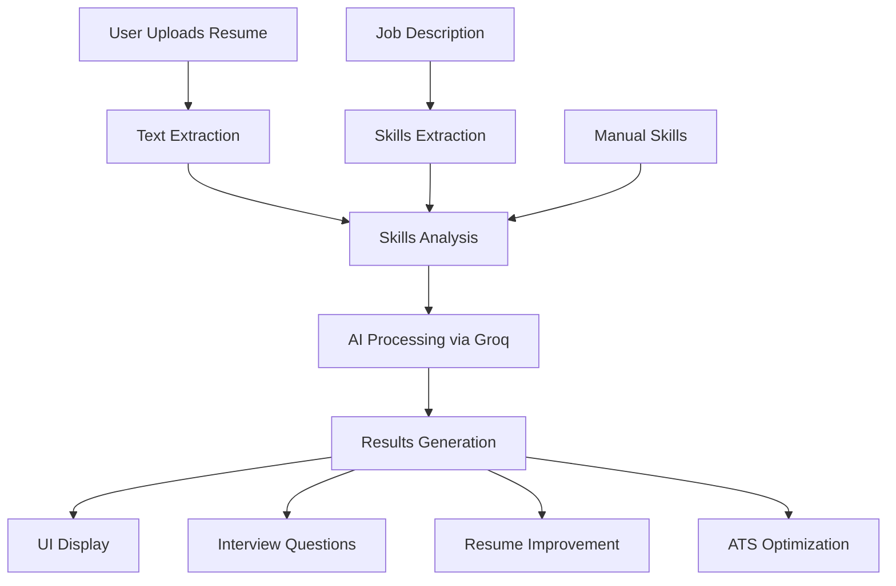

# 🏗️ Nightingale Recruitment Agent - Architecture

This document describes the architecture and structure of the Nightingale Recruitment Agent.

## 📁 Project Structure

```
Nightingale-recruitment-agent/
├── 📄 app.py                 # Main Streamlit application
├── 🤖 agents.py              # Core AI agent logic
├── 🎨 ui.py                  # UI components and styling
├── 📋 requirements.txt       # Essential dependencies
├── 🔧 install_optional.py    # Optional dependencies installer
├── 🧪 test_setup.py          # Setup verification script
├── 🚀 run_app.py             # Clean startup script
├── 📚 README.md              # Project documentation
├── 🤝 CONTRIBUTING.md        # Contribution guidelines
├── 📜 LICENSE                # MIT License
├── 🔒 .env.example           # Environment template
├── 🚫 .gitignore             # Git exclusions
└── 🏗️ ARCHITECTURE.md       # This file
```

## 🧩 Core Components

### 1. **app.py** - Main Application

- **Purpose**: Streamlit web interface
- **Key Features**:
  - Multi-tab interface (Analysis, Q&A, Interview, Improvement, Export)
  - API key management
  - Session state handling
  - Error handling and user feedback

### 2. **agents.py** - AI Agent Logic

- **Purpose**: Core resume analysis functionality
- **Key Classes**:
  - `ResumeAnalysisAgent`: Main analysis engine
  - `SimpleGroqClient`: Fallback API client
- **Key Methods**:
  - Resume text extraction (PDF/TXT)
  - Skill analysis and scoring
  - Interview question generation
  - Resume improvement and rewriting
  - ATS optimization

### 3. **ui.py** - User Interface Components

- **Purpose**: Reusable UI components and styling
- **Key Functions**:
  - Custom CSS themes (Nightingale branding)
  - Chart generation (Plotly)
  - Results display components
  - Interview question display

## 🔄 Data Flow



## 🧠 AI Processing Pipeline

### 1. **Text Extraction**

```python
PDF/TXT → PyPDF2/Text Reader → Raw Text
```

### 2. **Skills Analysis**

```python
Raw Text + Skills List → Groq LLM → Skill Scores (0-10)
```

### 3. **Vector Processing** (Optional)

```python
Text → OpenAI Embeddings → FAISS Vector Store → RAG Queries
```

### 4. **Resume Enhancement**

```python
Original Resume + Analysis → Groq LLM → Improved Resume
```

## 🔌 API Integration

### **Groq API** (Required)

- **Model**: `llama-3.1-70b-versatile`
- **Usage**: All LLM processing
- **Fallback**: Direct HTTP client if langchain unavailable

### **OpenAI API** (Optional)

- **Model**: `text-embedding-ada-002`
- **Usage**: Vector embeddings for enhanced search
- **Fallback**: Direct text analysis

## 🎨 UI Architecture

### **Theme System**

- **Primary Color**: `#e74c3c` (Nightingale Red)
- **Secondary Color**: `#c0392b` (Dark Red)
- **Framework**: Streamlit with custom CSS

### **Component Structure**

```
Main App
├── Header (Nightingale Branding)
├── Sidebar (Configuration)
└── Tabs
    ├── Resume Analysis
    ├── Resume Q&A
    ├── Interview Questions
    ├── Resume Improvement
    └── Improved Resume
```

## 🔧 Configuration Management

### **Environment Variables**

```bash
GROQ_API_KEY=required
OPENAI_API_KEY=optional
CUTOFF_SCORE=75
```

### **Session State**

- `analysis_result`: Resume analysis data
- `agent`: ResumeAnalysisAgent instance
- `interview_questions`: Generated questions
- `improved_resume`: Enhanced resume content

## 🚀 Deployment Options

### **Local Development**

```bash
python run_app.py
```

### **Production Deployment**

- **Streamlit Cloud**: Direct GitHub integration
- **Docker**: Containerized deployment
- **Heroku**: Web app hosting
- **AWS/GCP**: Cloud deployment

## 🔒 Security Considerations

### **API Key Protection**

- Environment variables only
- Never committed to git
- Masked in UI inputs

### **Data Privacy**

- No resume data stored permanently
- Temporary files cleaned up
- API calls over HTTPS

## 📊 Performance Optimization

### **Caching Strategy**

- Session state for analysis results
- Streamlit caching for UI components
- API response caching (future)

### **Error Handling**

- Graceful API failures
- Fallback processing modes
- User-friendly error messages

## 🔮 Future Architecture

### **Planned Enhancements**

- Database integration for resume storage
- User authentication system
- Batch processing capabilities
- Advanced analytics dashboard
- Multi-language support

### **Scalability Considerations**

- Microservices architecture
- Queue-based processing
- Load balancing
- CDN for static assets

## 🧪 Testing Strategy

### **Current Testing**

- Setup verification (`test_setup.py`)
- Manual UI testing
- API connection testing

### **Future Testing**

- Unit tests for core functions
- Integration tests for API calls
- UI automation tests
- Performance benchmarking

This architecture provides a solid foundation for the Nightingale Recruitment Agent while maintaining flexibility for future enhancements.
